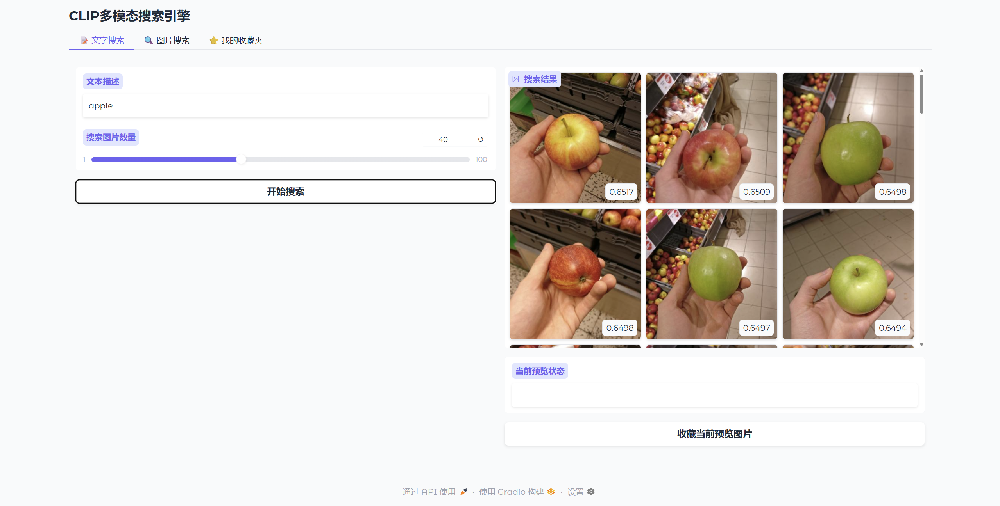
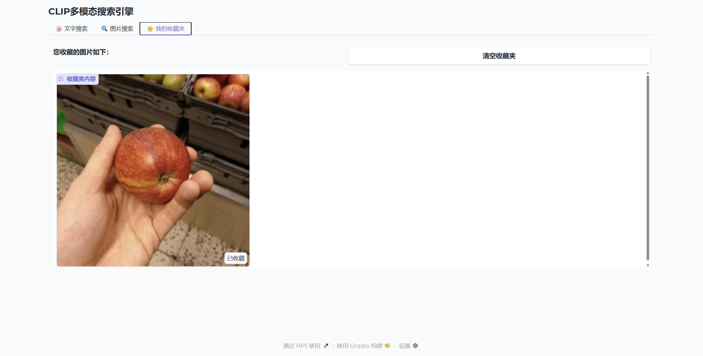

# Graph-Search -  CLIP-based Image Search System
## Functions
- Search images by text prompts
- Search images by uploading a reference image
- Overview the total number of the similar images.
- Add the images to the favorite.
- Click the favorite to see the favorite images.
- Clear the image and choose another one.

## Development Environment
- Development Environment: Windows 11
- Development Software:
    i. VSCODE 1.100.2
    ii. PyCharm 2025.1.1.1
    iii. Google Chrome 136.0.7103.114
- Development Language:
    i. python 3.12

## Core Libraries
- gradio
- dotenv
- matplotlib
- upstash_vector
- clip

## How to Run
- Run the command
```bash
python app.py
```

- After completing the loading of the model, enter the search image interface
    **Select "text search" or "image search"** to determine how to retrieve pictures
    

- Enter keywords and **click "start searching"** to search for pictures that match keywords
    

- After selecting the image, **click "add to favorites"** to add it to your favorites
  
- **Select "My Favorites"** to view favorites<br>
    

## Authors
| Name        | Student ID | Faculty           |
|-------------|------------|-------------------|
| Lei Wang    | 2351299    | School of Software |
| HaoTian Li  | 2354400    | School of Software |